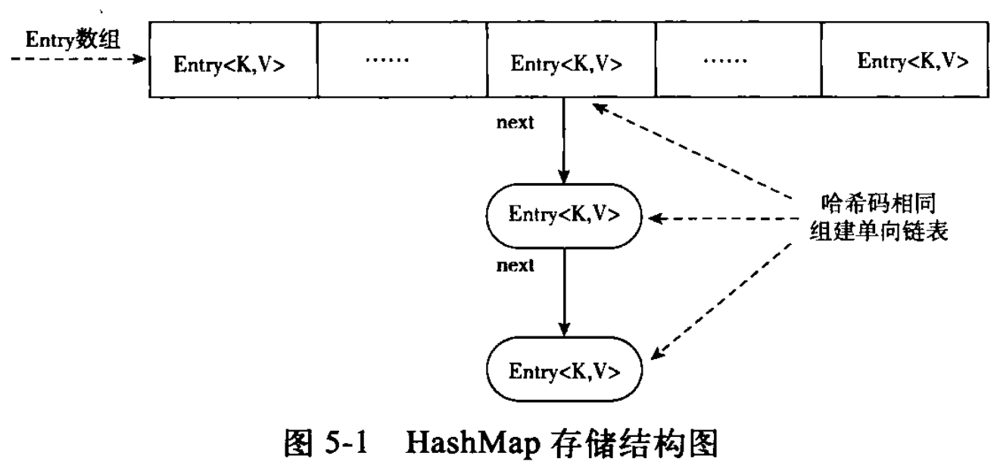

# Collection
  
* `Set`与`List`的最大区别就是`Set`中的元素不可重复（这个重复指的是`equals()`方法的返回值是否相等）。

## 1. ArrayList
* 当向`ArrayList`添加一个对象时，实际上就是将该对象放置到了`ArrayList`底层所维护的数组当中。
* `ArrayList`底层采用数组实现，当使用不带参数的构造方法生成`ArrayList`对象时，实际上会在底层生成一个长度为`10`的`Object`类型数组。
* 如果增加的元素个数超过了`10`个，那么`ArrayList`底层会新生成一个数组，长度为原数组的`1.5倍+1`，然后将原数组的内容复制到新数组当中，并且后续增加的内容都会放到新数组当中。当新数组无法容纳增加的元素时，重复该过程。
* 对于`ArrayList`元素的删除操作，需要将被删除元素的后续元素向前移动，代价比较高。
* 当执行搜索操作时，采用`ArrayList`比较好。一定是这样吗？请看[这里](#RandomAccess)。

## 2. Vector
* `Vector`是多线程版本的`ArrayList`。
* `Vector`的**每个**方法前都加上了`synchronized`关键字，同时只会允许一个线程进入方法，以此来保护集合中的数据不被`脏读`和`脏写`。
* `Vector`的`get()`方法：
  ```java
  public synchronized E get(int index) {
      if (index >= elementCount)
          throw new ArrayIndexOutOfBoundsException(index);

      return elementData(index);
  }
  ```

## 3. LinkedList
* `LinkedList`底层是使用双向循环链表实现。
* 当向`LinkedList`中添加一个对象时，实际上`LinkedList`内部会生成一个`Entry`对象，该`Entry`对象的结构为：
  ```java
  Entry {
      Entry previous;
      Object element;
      Entry next;
  }
  ```
* 其中的`Object`类型的元素 `element`就是我们向`LinkedList`中所添加的元素，然后`Entry`又构造好了向前与向后的引用`previous`、`next`，最后将生成的这个 `Entry`对象加入到了链表当中。换句话说，**`LinkedList`中所维护的是一个个的`Entry`对象**。
* 当执行插入或者删除操作时，采用`LinkedList`比较好。

## 4. HashSet
* `HashSet`底层是使用`HashMap`实现的。当使用`add()`方法将对象添加到`Set`当中时，实际上是将该对象作为底层所维护的`Map`对象的`key`，而`value`则都是同一个`Object`对象（该对象我们用不上）。
  ```java
  public class HashSet<E> extends AbstractSet<E> implements Set<E>, Cloneable, java.io.Serializable {

      private transient HashMap<E,Object> map;

      // Dummy value to associate with an Object in the backing Map
      private static final Object PRESENT = new Object();

      /**
       * Constructs a new, empty set; the backing <tt>HashMap</tt> instance has
       * default initial capacity (16) and load factor (0.75).
       */
      public HashSet() {
          map = new HashMap<>();
      }

      ...

      public boolean add(E e) {
          return map.put(e, PRESENT) == null;
      }

      public boolean remove(Object o) {
          return map.remove(o) == PRESENT;
      }

      public void clear() {
          map.clear();
      }

      ...
  }
  ```

## 5. TreeSet
* 可以自动排序的`Set`，默认排序为升序。它实现了`SortedSet`接口。
* `SortedSet`接口（`TreeSet`实现了该接口）只是定义了在给集合加入元素时将其进行排序，并不能保证元素修改后的排序结果，因此`TreeSet`适用于`不变量`的集合数据排序，比如`String`、`Integer`等类型。
* 解决上述`TreeSet`需要重排序的问题：
  * 重新生成一个`Set`对象，也就是对原有的`Set`对象重排序。
    ```java
    // 不可以使用`TreeSet(SortedSet<E> s)`构造函数，因为该构造函数只是对原`Set`的浅拷贝，如果集合里有相同的元素则不会重新排序。
    SortedSet newSet = new TreeSet<T>(new ArrayList<T>(oldSet));
    ```
  * 使用`List`，也就是使用`Collections.sort()`方法对`List`进行排序。
  * 对于`不变量`的排序，例如直接量（也就是8个基本类型）、`String`类型等，推荐使用`TreeSet`。而对于`可变量`，例如我们自己写的类，可能会在逻辑处理中改变其排序关键值的，则建议使用`List`自行排序。

## 6. EnumSet
* 枚举类型的专用`Set`，所有元素都是枚举类型。

## 7. HashMap
* `HashMap`底层维护一个数组，我们向`HashMap`中所放置的对象实际上是存储在该数组当中。
* 当向`HashMap`中`put`一对键值时，它会根据`key`的`hashCode`值计算出一个位置，该位置就是此对象 准备往数组中存放的位置。
* 如果该位置没有对象存在，就将此对象直接放进数组当中；如果该位置已经有对象存在了，则顺着此存在的对象的链开始寻找（`Entry`类有一个`Entry`类型的`next`成员变量，指向了该对象的下一个对象），如果此链上有对象的话，再去使用`equals()`方法进行比较，如果对此链上的某个对象的`equals()`方法比较为`false`，则将该对象放到数组当中，然后将数组中该位置以前存在的那个对象链接到此对象的后面。
* HashMap存储结构图：
  
* 元素查找：使用`hashCode`定位元素，若有哈希冲突，则遍历对比。

## 8. Hashtable
* `Hashtable`是多线程版本的`HashMap`。
* `Hashtable`的**每个**方法前都加上了`synchronized`关键字，同时只会允许一个线程进入方法，以此来保护集合中的数据不被`脏读`和`脏写`。
* `Hashtable`的`get()`方法：
  ```java
  public synchronized V get(Object key) {
      Entry<?,?> tab[] = table;
      int hash = key.hashCode();
      int index = (hash & 0x7FFFFFFF) % tab.length;
      for (Entry<?,?> e = tab[index] ; e != null ; e = e.next) {
          if ((e.hash == hash) && e.key.equals(key)) {
              return (V)e.value;
          }
      }
      return null;
  }
  ```

## 9. 线程安全 和 同步修改异常
* `java.util.ConcurrentModificationException`：基本上所有的集合类都有一个叫做`快速失败（Fail-Fast）`的检验机制，当一个集合在被多个线程修改并访问时，就可能会出现`ConcurrentModificationException`异常，这是为了确保集合方法一致而设置的保护措施，它的实现原理是`modCount`修改计数器，如果在读列表时，`modCount`发生变化（也就是有其他线程修改）则会抛出`ConcurrentModificationException`异常。这与线程不是一个概念，线程同步是为了保护集合中的数据不被`脏读`和`脏写`。

## 10. 解决同步修改异常
* 单线程时：remove元素请使用`Iterator`方式。
* 多线程时：
  * 对`Iterator`对象加锁
  * 使用`Vector` 和 `Hashtable`
  * 将线程不安全的集合类包装成线程安全的（注意：进行遍历时要手动进行同步处理，可以指定锁定的对象）
    > **`java.util.Collections.synchronizedXxx(...);`**  
    > **`java.util.Collections.synchronizedSortedSet(...);`**  
    > **`java.util.Collections.synchronizedSortedMap(...);`**
    * **`List<Integer> list = Collections.synchronizedList(new ArrayList<>());`**
      ```java
      /**
       * Returns a synchronized (thread-safe) list backed by the specified
       * list.  In order to guarantee serial access, it is critical that
       * <strong>all</strong> access to the backing list is accomplished
       * through the returned list.<p>
       *
       * It is imperative that the user manually synchronize on the returned
       * list when iterating over it:
       * <pre>
       *  List list = Collections.synchronizedList(new ArrayList());
       *      ...
       *  synchronized (list) {
       *      Iterator i = list.iterator(); // Must be in synchronized block
       *      while (i.hasNext())
       *          foo(i.next());
       *  }
       * </pre>
       * Failure to follow this advice may result in non-deterministic behavior.
       *
       * <p>The returned list will be serializable if the specified list is
       * serializable.
       *
       * @param  <T> the class of the objects in the list
       * @param  list the list to be "wrapped" in a synchronized list.
       * @return a synchronized view of the specified list.
       */
      public static <T> List<T> synchronizedList(List<T> list) {
          return (list instanceof RandomAccess ?
                  new SynchronizedRandomAccessList<>(list) :
                  new SynchronizedList<>(list));
      }

      static class SynchronizedCollection<E> implements Collection<E>, Serializable {

          final Collection<E> c;  // Backing Collection
          final Object mutex;     // Object on which to synchronize

          SynchronizedCollection(Collection<E> c) {
              this.c = Objects.requireNonNull(c);
              mutex = this;
          }

          SynchronizedCollection(Collection<E> c, Object mutex) {
              this.c = Objects.requireNonNull(c);
              this.mutex = Objects.requireNonNull(mutex);
          }
      }
      
      static class SynchronizedList<E> extends SynchronizedCollection<E> implements List<E> {
          final List<E> list;

          public E get(int index) {
              synchronized (mutex) {return list.get(index);}
          }
          public E set(int index, E element) {
              synchronized (mutex) {return list.set(index, element);}
          }
          public void add(int index, E element) {
              synchronized (mutex) {list.add(index, element);}
          }
          public E remove(int index) {
              synchronized (mutex) {return list.remove(index);}
          }

          public ListIterator<E> listIterator() {
              return list.listIterator(); // Must be manually synched by user
          }

          public ListIterator<E> listIterator(int index) {
              return list.listIterator(index); // Must be manually synched by user
          }
      }

      static class SynchronizedRandomAccessList<E> extends SynchronizedList<E> implements RandomAccess {
          ...
      }
      ```
    * **`Set<Integer> set = Collections.synchronizedSet(new HashSet<>());`**
      ```java
      static class SynchronizedSet<E>
            extends SynchronizedCollection<E>
            implements Set<E> {
          private static final long serialVersionUID = 487447009682186044L;

          SynchronizedSet(Set<E> s) {
              super(s);
          }
          SynchronizedSet(Set<E> s, Object mutex) {
              super(s, mutex);
          }

          public boolean equals(Object o) {
              if (this == o)
                  return true;
              synchronized (mutex) {return c.equals(o);}
          }
          public int hashCode() {
              synchronized (mutex) {return c.hashCode();}
          }
      }
      ```
    * **`Map<String, String> map  = Collections.synchronizedMap(new HashMap<>());`**
      ```java
      private static class SynchronizedMap<K,V> implements Map<K,V>, Serializable {

          private final Map<K,V> m;     // Backing Map
          final Object      mutex;        // Object on which to synchronize

          SynchronizedMap(Map<K,V> m) {
              this.m = Objects.requireNonNull(m);
              mutex = this;
          }

          SynchronizedMap(Map<K,V> m, Object mutex) {
              this.m = m;
              this.mutex = mutex;
          }

          ...

          public V get(Object key) {
              synchronized (mutex) {return m.get(key);}
          }

          public V put(K key, V value) {
              synchronized (mutex) {return m.put(key, value);}
          }
          public V remove(Object key) {
              synchronized (mutex) {return m.remove(key);}
          }
          public void putAll(Map<? extends K, ? extends V> map) {
              synchronized (mutex) {m.putAll(map);}
          }
          public void clear() {
              synchronized (mutex) {m.clear();}
          }

          private transient Set<K> keySet;
          private transient Set<Map.Entry<K,V>> entrySet;
          private transient Collection<V> values;

          public Set<K> keySet() {
              synchronized (mutex) {
                  if (keySet==null)
                      keySet = new SynchronizedSet<>(m.keySet(), mutex);
                  return keySet;
              }
          }

          public Set<Map.Entry<K,V>> entrySet() {
              synchronized (mutex) {
                  if (entrySet==null)
                      entrySet = new SynchronizedSet<>(m.entrySet(), mutex);
                  return entrySet;
              }
          }

          public Collection<V> values() {
              synchronized (mutex) {
                  if (values==null)
                      values = new SynchronizedCollection<>(m.values(), mutex);
                  return values;
              }
          }
      }
      ```
  * **使用JDK 1.5新增的`CopyOnWriteArrayList`、`CopyOnWriteArraySet`以及`ConcurrentHasMap`，他们位于`java.util.concurrent`包下。**

## 11. CopyOnWriteArrayList
*  Copy-On-Write（写入时复制，简称COW）：往容器添加新元素的时候，不直接往当前的Object[]数组中添加，而是先将当前容器的Object[]数组进行Copy，复制出一个新的Object[]数组，然后往新的Object[]数组里添加元素，添加完元素之后，再将原数组的引用指向新的数组。这样做的好处是可以对容器进行并发的读而不需要加锁，因为当前容器的Object[]数组不会添加任何元素。CopyOnWrite容器也是一种**读写分离**思想的实现，读和写针对的是不同的数组。
    ```java
    public class CopyOnWriteArrayList<E> implements List<E>, RandomAccess, Cloneable, java.io.Serializable {

        /** The lock protecting all mutators */
        final transient ReentrantLock lock = new ReentrantLock();

        /** The array, accessed only via getArray/setArray. */
        private transient volatile Object[] array;

        /**  Gets the array.  Non-private so as to also be accessible from CopyOnWriteArraySet class. */
        final Object[] getArray() {
            return array;
        }

        /** Sets the array. */
        final void setArray(Object[] a) {
            array = a;
        }

        /**  Creates an empty list. */
        public CopyOnWriteArrayList() {
            setArray(new Object[0]);
        }

        ...

        private E get(Object[] a, int index) {
            return (E) a[index];
        }

        public E get(int index) {
            return get(getArray(), index);
        }

        /**
         * Appends the specified element to the end of this list.
         *
         * @param e element to be appended to this list
         * @return {@code true} (as specified by {@link Collection#add})
         */
        public boolean add(E e) {
            final ReentrantLock lock = this.lock;
            lock.lock();
            try {
                Object[] elements = getArray();
                int len = elements.length;
                Object[] newElements = Arrays.copyOf(elements, len + 1); // 将原数组的数据全部复制到新的数组
                newElements[len] = e; // 将add的元素添加到新数组
                setArray(newElements); // 将新的数组赋给原来的引用
                return true;
            } finally {
                lock.unlock();
            }
        }

        /**
         * Appends the element, if not present.
         *
         * @param e element to be added to this list, if absent
         * @return {@code true} if the element was added
         */
        public boolean addIfAbsent(E e) {
            Object[] snapshot = getArray();
            return indexOf(e, snapshot, 0, snapshot.length) >= 0 ? false :
                addIfAbsent(e, snapshot);
        }

        ...
    }
    ```

## 12. CopyOnWriteArraySet
* 底层使用`CopyOnWriteArrayList`：
  ```java
  public class CopyOnWriteArraySet<E> extends AbstractSet<E> implements java.io.Serializable {

      private final CopyOnWriteArrayList<E> al;

      public CopyOnWriteArraySet() {
          al = new CopyOnWriteArrayList<E>();
      }

      ...

      public boolean add(E e) {
          return al.addIfAbsent(e);
      }

      ...
  }
  ```

## 13. ConcurrentHashMap
* `public class ConcurrentHashMap<K,V> extends AbstractMap<K,V> implements ConcurrentMap<K,V>, Serializable {}`

## 14. 使用优雅的方式进行集合运算
* 并集，也叫合集
  ```java
  listOne.addAll(listTwo);
  ```
* 交集，计算两个集合的共有元素
  ```java
  listOne.retainAll(listTwo);
  ```
* 差集，由所有属于A但不属于B的元素组成的集合叫做A与B的差集
  ```java
  listOne.removeAll(listTwo);
  ```
* 无重复的并集
  ```java
  // 删除在listOne中出现的元素
  listTwo.removeAll(listOne);
  // 把剩余的listTwo元素加到listOne中
  listOne.addAll(listTwo);
  ```
* 打乱一个列表的顺序
  ```java
  Collections.shuffle(list);
  ```

## 15. <span id="RandomAccess">列表遍历方式</span>
* 随机存储
  * `RandomAccess`接口：随机存储接口，和`Cloneable`、`Serializable`一样都是`标志性接口`，不需要任何实现，只是用来表明其实现类具有某种特质。
  * `ArrayList`实现了`RandomAccess`接口，这就标志着`ArrayList`是一个可以随机存取的列表。也就是说其数据元素之间没有关联，即两个位置相邻的元素之间没有相互依赖和索引关系。
  * 由于`foreach`语法是对`iterator`（迭代器）的包装，如果`ArrayList`使用`foreach`语法进行遍历，就必须要强制建立一种元素互相『知晓』的关系，比如上一个元素可以判断是否有下一个元素以及下一个元素是什么等等这样的关系。所以不要使用`foreach`的方式去遍历`ArrayList`，而是应该使用`下标方式`遍历`ArrayList`，因为**使用`foreach`遍历`ArrayList`前会有一个建立元素相系关系的耗时操作**。
* 有序存储
  * `LinkedList`底层是使用双向循环链表实现的，也就是说在`LinkedList`中元素之间本来就是有关联的，所以应该使用`foreach`遍历`LinkedList`，而不是`下标方式`。我们来看下源码：
    ```java
    public E get(int index) {
        checkElementIndex(index);
        // 由 node() 方法查找指定下标的节点，然后返回其包含的元素
        return node(index).item;
    }

    // 先判断输入的下标与中间值（size右移一位，也就是除以2）的关系，小于中间值则从头开始正向搜索，
    // 大于中间值则从尾节点反向搜索，每一次的 get() 方法都是一个遍历。
    Node<E> node(int index) {
        // assert isElementIndex(index);

        if (index < (size >> 1)) {
            // 如果下标小于中间值，则从头节点开始搜索
            Node<E> x = first;
            for (int i = 0; i < index; i++)
                x = x.next;
            return x;
        } else {
            Node<E> x = last;
            // 如果下标大于等于中间值，则从尾节点反向遍历
            for (int i = size - 1; i > index; i--)
                x = x.prev;
            return x;
        }
    }
    ```

## 参考文献：
* 《编写高质量代码：改善Java程序的151个建议》/秦小波著. 机械工业出版社，2011.11
* 北京圣思园Java培训教学视频
